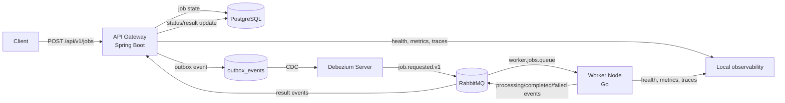

# Task Engine

[](https://github.com/RichardLitt/standard-readme)
[](LICENSE)

A learning PoC for reliable distributed task execution with Spring Boot, Go, PostgreSQL, Debezium, and RabbitMQ.

Task Engine is a proof-of-concept system for studying how distributed services can coordinate asynchronous work without losing state or duplicating side effects. It accepts task requests over HTTP, stores job state in PostgreSQL, emits durable outbox events through Debezium, processes jobs in a Go worker through RabbitMQ, and applies worker result events back to the API service.

This repository is intentionally small enough to read end to end, but it includes patterns that matter in production systems: transactional outbox, event contracts, idempotency, retries, dead-letter queues, health checks, metrics, and OpenTelemetry tracing. It is built for local learning and experimentation, not as a production-ready task platform.

## Table of Contents

- [Security](#security)
- [Background](#background)
- [Install](#install)
- [Usage](#usage)
- [Architecture](#architecture)
- [Configuration](#configuration)
- [Event Contracts](#event-contracts)
- [Observability](#observability)
- [Testing](#testing)
- [Troubleshooting](#troubleshooting)
- [API](#api)
- [Contributing](#contributing)
- [License](#license)

## Security

This project is a local proof of concept. Do not deploy it to a public network without a security review.

The sample stack exposes an unauthenticated HTTP API on port `8080`, RabbitMQ Management on port `15672`, and local observability endpoints. The credentials in `.env.example` are for local development only. Keep real secrets out of commits, rotate any credentials before sharing an environment, and treat `.env` as machine-local configuration.

## Background

The PoC focuses on a common distributed-systems problem: accepting work synchronously while doing the actual processing asynchronously and reliably.

The system demonstrates:

- Transactional outbox: the API stores a job and its `job.requested.v1` event in one PostgreSQL transaction.
- Change data capture: Debezium reads the outbox table and publishes command events to RabbitMQ.
- Worker isolation: the Go worker consumes commands, simulates work, and publishes result events.
- Idempotency: callers can send `clientRequestId` to avoid creating duplicate jobs.
- Event contracts: Java and Go validate shared JSON event envelopes and payload schemas.
- Retry and dead-letter handling: failed command processing can retry and eventually dead-letter.
- Observability: services expose health checks, metrics, and OpenTelemetry traces.

The implementation is intentionally polyglot:

- `api-gateway` is a Spring Boot service with REST endpoints, PostgreSQL persistence, Flyway migrations, RabbitMQ result consumption, and Micrometer/OpenTelemetry instrumentation.
- `worker-node` is a Go service that consumes RabbitMQ commands, validates contracts, emits processing/completed/failed events, and exposes health and metrics endpoints.
- `infra` contains local infrastructure configuration for PostgreSQL, RabbitMQ, Debezium, Jaeger, and load testing.

## Install

The simplest way to run the full PoC is Docker Compose.

Dependencies:

- Docker with Docker Compose support
- `curl` for shell examples
- PowerShell 7+ if you use the Windows smoke script
- Java 25 for running API tests locally
- Go 1.26.1 for running worker tests locally
- k6 for the optional load test

Create local environment configuration:

```sh
cp .env.example .env
```

On Windows PowerShell:

```powershell
Copy-Item .env.example .env
```

Edit `.env` if you want different local passwords or worker concurrency. Then build and start the stack:

```sh
docker compose up --build -d
```

Confirm the containers are healthy:

```sh
docker compose ps
curl http://localhost:8080/actuator/health/readiness
curl http://localhost:8090/healthz
```

Stop the stack:

```sh
docker compose down
```

Remove persistent local volumes when you want a clean database, RabbitMQ state, and Debezium offsets:

```sh
docker compose down -v
```

## Usage

Submit a job:

```sh
curl -i -X POST http://localhost:8080/api/v1/jobs \
  -H "Content-Type: application/json" \
  -d '{"taskType":"matrix_multiplication","complexity":3,"clientRequestId":"demo-001"}'
```

New jobs return `202 Accepted`. Reusing the same `clientRequestId` returns `200 OK` with the original job instead of creating a duplicate:

```sh
curl -i -X POST http://localhost:8080/api/v1/jobs \
  -H "Content-Type: application/json" \
  -d '{"taskType":"matrix_multiplication","complexity":3,"clientRequestId":"demo-001"}'
```

Get a job by ID:

```sh
curl http://localhost:8080/api/v1/jobs/<job-id>
```

List and filter jobs:

```sh
curl "http://localhost:8080/api/v1/jobs?size=20"
curl "http://localhost:8080/api/v1/jobs?status=COMPLETED"
curl "http://localhost:8080/api/v1/jobs?clientRequestId=demo-001&size=1"
```

Cancel a job:

```sh
curl -X POST http://localhost:8080/api/v1/jobs/<job-id>/cancel
```

Force the worker failure path:

```sh
curl -i -X POST http://localhost:8080/api/v1/jobs \
  -H "Content-Type: application/json" \
  -d '{"taskType":"force_failure","complexity":1,"clientRequestId":"fail-demo-001"}'
```

Run the end-to-end smoke test after the stack is healthy:

```sh
./scripts/smoke.sh
```

On Windows PowerShell:

```powershell
.\scripts\smoke.ps1
```

The smoke test submits a job, verifies idempotent submission, waits for `PROCESSING` and `COMPLETED`, cancels another job, and checks that a late worker result does not overwrite `CANCELLED`.

## Architecture



Runtime flow:

1. A client submits `POST /api/v1/jobs`.
2. The API validates the request and stores a queued job in PostgreSQL.
3. In the same transaction, the API stores a `job.requested.v1` event in the outbox.
4. Debezium tails PostgreSQL changes and publishes the outbox event to RabbitMQ.
5. The Go worker consumes the command, emits `job.processing.v1`, simulates work, and emits either `job.completed.v1` or `job.failed.v1`.
6. The API consumes result events and updates the job record.
7. Clients poll `GET /api/v1/jobs/{jobId}` or list jobs by status/client request ID.

## Configuration

Local defaults live in [.env.example](.env.example). Copy it to `.env` before starting Docker Compose.

| Variable                       | Used by                         | Purpose                                  |
| ------------------------------ | ------------------------------- | ---------------------------------------- |
| `POSTGRES_USER`                | PostgreSQL, API, Debezium       | Local database user                      |
| `POSTGRES_PASSWORD`            | PostgreSQL, API, Debezium       | Local database password                  |
| `POSTGRES_DB`                  | PostgreSQL, API, Debezium       | Local database name                      |
| `RABBITMQ_USER`                | RabbitMQ, API, worker, Debezium | Local broker user                        |
| `RABBITMQ_PASSWORD`            | RabbitMQ, API, worker, Debezium | Local broker password                    |
| `WORKER_CONCURRENCY`           | Worker                          | Number of concurrent message handlers    |
| `TRACING_SAMPLING_PROBABILITY` | API                             | OpenTelemetry trace sampling probability |

Published local ports:

| Port    | Service     | Purpose                               |
| ------- | ----------- | ------------------------------------- |
| `8080`  | API Gateway | Job API and Spring Actuator endpoints |
| `8090`  | Worker Node | Worker health and metrics endpoints   |
| `15672` | RabbitMQ    | RabbitMQ Management UI                |
| `16686` | Jaeger      | Trace search UI                       |

PostgreSQL, RabbitMQ AMQP, and Debezium communicate on the Compose network by default. The Compose file does not publish PostgreSQL or RabbitMQ AMQP ports to the host.

## Event Contracts

Event contracts are defined in [contracts/asyncapi.yaml](contracts/asyncapi.yaml) and the JSON schemas under [contracts/events](contracts/events).

The current event types are:

- `job.requested.v1`
- `job.processing.v1`
- `job.completed.v1`
- `job.failed.v1`

Both services use the shared contract files to keep event envelopes and payloads consistent. The API validates outgoing and incoming events in Java, while the worker validates consumed command events and published result events in Go.

## Observability

API Gateway endpoints:

```sh
curl http://localhost:8080/actuator/health/readiness
curl http://localhost:8080/actuator/prometheus
curl http://localhost:8080/actuator/metrics
```

Worker endpoints:

```sh
curl http://localhost:8090/healthz
curl http://localhost:8090/metrics
```

Local UIs:

- RabbitMQ Management: <http://localhost:15672>
- Jaeger UI: <http://localhost:16686>

Use the RabbitMQ credentials from `.env`. Jaeger receives OpenTelemetry traces from the API over HTTP and from the worker over OTLP gRPC through the Compose network.

## Testing

Run API tests:

```sh
cd api-gateway
./mvnw test
```

On Windows PowerShell:

```powershell
cd api-gateway
.\mvnw.cmd test
```

Run worker tests:

```sh
cd worker-node
go test ./...
```

Run the end-to-end smoke test with the Compose stack already healthy:

```sh
./scripts/smoke.sh
```

On Windows PowerShell:

```powershell
.\scripts\smoke.ps1
```

Run the optional load test from the repository root:

```sh
k6 run infra/load-tests/k6-script.js
```

Override the API URL for smoke or load tests:

```sh
API_URL=http://localhost:8080 ./scripts/smoke.sh
API_URL=http://localhost:8080 k6 run infra/load-tests/k6-script.js
```

## Troubleshooting

Check container health and logs:

```sh
docker compose ps
docker compose logs -f api-gateway worker-node debezium rabbitmq postgres
```

If services stay unhealthy after configuration changes, reset local persistent state:

```sh
docker compose down -v
docker compose up --build -d
```

Common issues:

- Port conflicts: stop other services using `8080`, `8090`, `15672`, or `16686`, or change the published ports in `compose.yaml`.
- RabbitMQ login failure: use the credentials from your local `.env`, not the placeholder values in examples.
- Debezium startup delay: wait for PostgreSQL and RabbitMQ health checks to pass before sending jobs.
- Jobs remain `QUEUED`: inspect Debezium and RabbitMQ logs, then confirm the worker is healthy.
- Jobs become `FAILED`: inspect worker logs and try `taskType: "force_failure"` to compare with the intentional failure path.
- Cancelled jobs should remain `CANCELLED` even if a late worker result arrives; run the smoke test to verify that behavior.

## API

Base URL for local Compose usage:

```text
http://localhost:8080
```

Endpoints:

| Method | Path                          | Description                                                              |
| ------ | ----------------------------- | ------------------------------------------------------------------------ |
| `POST` | `/api/v1/jobs`                | Create a job, or return an existing job for a repeated `clientRequestId` |
| `GET`  | `/api/v1/jobs`                | List jobs with optional filters and pagination                           |
| `GET`  | `/api/v1/jobs/{jobId}`        | Get one job by ID                                                        |
| `POST` | `/api/v1/jobs/{jobId}/cancel` | Cancel a job                                                             |

Job request fields:

| Field             | Type    | Required | Notes                                                                              |
| ----------------- | ------- | -------- | ---------------------------------------------------------------------------------- |
| `taskType`        | string  | yes      | Must not be blank. Use `force_failure` to trigger the worker failure path.         |
| `complexity`      | integer | yes      | Must be between `1` and `10`. The worker sleeps this many seconds for normal jobs. |
| `clientRequestId` | string  | no       | Optional idempotency key, maximum 128 characters.                                  |

Example request:

```json
{
  "taskType": "matrix_multiplication",
  "complexity": 3,
  "clientRequestId": "demo-001"
}
```

Job statuses:

| Status       | Meaning                                   |
| ------------ | ----------------------------------------- |
| `PENDING`    | Initial state before queueing work        |
| `QUEUED`     | Job request has been accepted and queued  |
| `PROCESSING` | Worker has started processing             |
| `COMPLETED`  | Worker completed successfully             |
| `FAILED`     | Worker or event handling reported failure |
| `CANCELLED`  | Job was cancelled                         |

Example response shape:

```json
{
  "id": "00000000-0000-0000-0000-000000000000",
  "taskType": "matrix_multiplication",
  "complexity": 3,
  "status": "COMPLETED",
  "result": "{\"status\":\"success\"}",
  "failureMessage": null,
  "clientRequestId": "demo-001",
  "correlationId": "00000000-0000-0000-0000-000000000000",
  "createdAt": "2026-05-27T00:00:00Z",
  "updatedAt": "2026-05-27T00:00:03Z"
}
```

## Contributing

Questions, bug reports, and improvement ideas should go through [GitHub Issues](https://github.com/powoftech/task-engine/issues).

Focused pull requests are accepted. Keep changes scoped, include tests for behavior changes, and update this README when setup, usage, configuration, or API behavior changes.

## License

[MIT](LICENSE) © 2026 Phuong Dang
